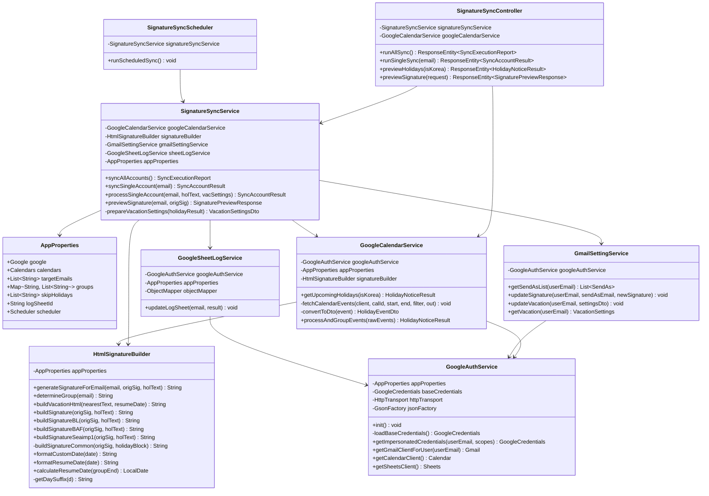
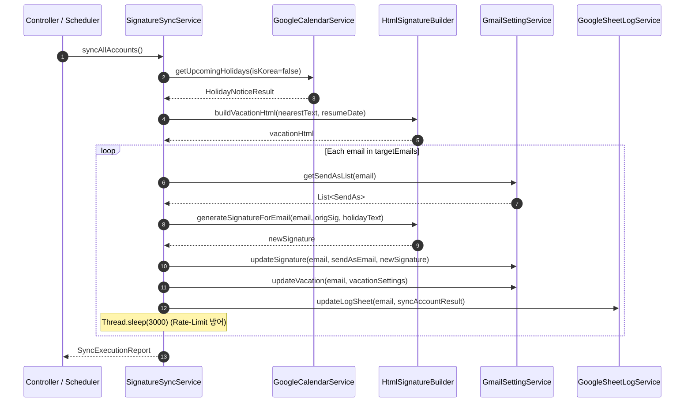

# FATES 메일 서명 & 부재중 자동응답 시스템 프로그램 상세설계서 (Detailed Technical Design Specification)

**문서 버전**: v1.0.0  
**작성일자**: 2026-08-25  
**대상 시스템**: `fates-system` (Spring Boot 4.x / Java 17)  
**작성 범위**: 클래스 다이어그램, 클래스/메서드 단위 상세 명세, 정규표현식 엔진 규칙, 데이터 모델 및 DTO 명세, 시퀀스 흐름, 단위 테스트 명세  

---

## 1. 클래스 구조 및 의존성 다이어그램 (Class Diagram)



---

## 2. 클래스 및 메서드 상세 명세 (Class & Method Specification)

### 2.1 `com.example.fates_system.service.GoogleAuthService`

#### 1) 클래스 개요
Google Cloud Service Account 기반으로 애플리케이션 기본 자격증명을 초기화하고, 대상 사용자(`userEmail`)로의 Domain-Wide Delegation(도메인 전체 위임) 세션을 생성하여 Google API Client 인스턴스를 공급합니다.

#### 2) 필드 명세
| 필드명 | 타입 | 접근자 | 설명 |
| :--- | :--- | :--- | :--- |
| `appProperties` | `AppProperties` | private final | 설정 프로퍼티 주입 |
| `baseCredentials` | `GoogleCredentials` | private | Service Account 기본 자격증명 객체 |
| `httpTransport` | `HttpTransport` | private | Google Net HTTP Transport 싱글톤 |
| `jsonFactory` | `GsonFactory` | private final | JSON 파싱 팩토리 (`GsonFactory.getDefaultInstance()`) |
| `GMAIL_SCOPES` | `List<String>` | private static final | Gmail 서명 및 설정 제어 스코프 |
| `CALENDAR_SCOPES` | `List<String>` | private static final | Google Calendar 읽기 전용 스코프 |
| `SHEETS_SCOPES` | `List<String>` | private static final | Google Sheets 읽기/쓰기 스코프 |

#### 3) 주요 메서드 명세

##### `public void init()`
- **역할**: `@PostConstruct` 라이프사이클 메서드로 HTTP Transport 및 기본 자격증명을 사전 로드.
- **예외 처리**: 파일 미존재 시 경고 로그를 기록하고 런타임 호출 시점에 재시도하도록 허용.

##### `public GoogleCredentials getImpersonatedCredentials(String userEmail, List<String> scopes)`
- **파라미터**:
  - `userEmail` (`String`): 도메인 전체 위임 대상 사용자 이메일
  - `scopes` (`List<String>`): 요청할 OAuth2 스코프 목록
- **반환값**: `GoogleCredentials` (위임된 자격증명)
- **로직**:
  1. `baseCredentials`가 `ServiceAccountCredentials` 인스턴스인지 확인.
  2. `((ServiceAccountCredentials) baseCredentials).createScoped(scopes).createDelegated(userEmail)` 호출하여 사용자 세션 생성.

##### `public Gmail getGmailClientForUser(String userEmail)`
- **반환값**: 해당 사용자로 위임된 `Gmail` 클라이언트 인스턴스.

##### `public Calendar getCalendarClient()`
- **반환값**: 캘린더 읽기 권한을 보유한 `Calendar` 클라이언트 인스턴스.

##### `public Sheets getSheetsClient()`
- **반환값**: 스프레드시트 쓰기 권한을 보유한 `Sheets` 클라이언트 인스턴스.

---

### 2.2 `com.example.fates_system.service.GoogleCalendarService`

#### 1) 클래스 개요
한국, 일본 및 FATES 전용 캘린더로부터 향후 3개월간의 이벤트를 수집하고, 주말/기념일 필터링, 연속 연휴 병합 및 특별 연휴 명칭을 판별하여 HTML 공휴일 안내문을 생성합니다.

#### 2) 주요 메서드 명세

##### `public HolidayNoticeResult getUpcomingHolidays(boolean isKorea)`
- **파라미터**: `isKorea` (`boolean`) - 한국 캘린더 조회 여부 (기본: 일본 캘린더)
- **반환값**: `HolidayNoticeResult`
- **동작 흐름**:
  1. `startDate = now`, `endDate = now + 3 months` 설정 (타임존: `Asia/Tokyo` 또는 `Asia/Seoul`).
  2. 캘린더 ID별 이벤트 조회:
     - 한국: `appProperties.getCalendars().getKorea()` 조회
     - 일본: `appProperties.getCalendars().getJapan()` + `appProperties.getCalendars().getCustom()` 동시 조회
  3. 필터 조건 적용:
     - 공통: `dayOfWeek != SATURDAY && dayOfWeek != SUNDAY`
     - 공통: `!skipHolidays.contains(title)`
     - 커스텀: `title.toUpperCase()`에 `GOLDEN`, `SILVER`, `NEW` 포함 여부 확인
  4. `processAndGroupEvents(rawEvents)` 호출하여 결과 생성.

##### `public HolidayNoticeResult processAndGroupEvents(List<HolidayEventDto> rawEvents)`
- **연휴 병합 및 포맷 알고리즘**:
  ```
  1. rawEvents를 start 오름차순, end 내림차순으로 정렬
  2. 첫 번째 이벤트를 cur 그룹(start, end, [title])으로 초기화
  3. 반복문 (i = 1 to n):
     if (ev.start <= cur.end):
         cur.end = max(cur.end, ev.end)
         if (!cur.names.contains(ev.title)) cur.names.add(ev.title)
     else:
         grouped.add(cur)
         cur = new Group(ev.start, ev.end, [ev.title])
  4. grouped.add(cur)
  5. 각 그룹별 summary 결정:
     - summary.toUpperCase()가 "GOLDEN" 포함 OR (start.month == 5 AND names.size > 1) -> "Golden Week"
     - summary.toUpperCase()가 "SILVER" 포함 OR (start.month == 9 AND names.size > 1) -> "Silver Week"
     - summary.toUpperCase()가 "NEW" 포함 -> "New Year Holidays"
     - 그 외 -> names.join(", ")
  6. 날짜 문자열 구성:
     - durationDays > 1: "May 3rd (Sat) ~ May 6th (Tue): Golden Week"
     - durationDays == 1: "August 11th (Tue): Mountain Day"
  7. resumeDate = signatureBuilder.calculateResumeDate(grouped[0].end)
  ```

---

### 2.3 `com.example.fates_system.service.HtmlSignatureBuilder`

#### 1) 클래스 개요
각 사용자 이메일 주소의 그룹(`BL1`, `BAF`, `SEAIMP1`, `DEFAULT`)을 판별하고, 해당 그룹의 정규식 패턴에 맞추어 기존 서명을 수정하거나 새 서명 블록을 생성합니다. 또한 부재중 자동응답 HTML 템플릿을 생성합니다.

#### 2) 정규표현식 상수 및 치환 로직 상세

##### `NOTICE_PATTERN`
- **정의**: `<span[^>]*>\s*\*\*HOLIDAY NOTICE\*\*[\s\S]*?</span>(?:<br\s*/?>)*` (Case Insensitive)
- **용도**: 서명 본문 내 이미 존재하는 이전 `**HOLIDAY NOTICE**` 블록을 전체 탐색하여 새 블록으로 교체.

##### `COMPANY_PATTERN`
- **정의**: `株式会社FATES|\(ファテス\)`
- **용도**: 기존 공휴일 안내문이 없을 경우 회사명 표기 바로 앞 위치에 공휴일 블록을 삽입.

##### `BAF_PATTERN`
- **정의**: `[\s\S]*?\*\*HOLIDAY NOTICE\*\*[\s\S]*?(?=(?:<[^>]+>|\s)*●?(?:<[^>]+>|\s)*도착지(?:<[^>]+>|\s)*[Bb][Aa][Ff](?:<[^>]+>|\s)*요\s*금)`
- **용도**: BAF 그룹 및 SEAIMP1 그룹의 서명에서 `● 도착지 BAF 요금` 섹션 직전의 공휴일 블록 영역을 정확히 매칭하여 치환.

#### 3) 그룹별 서명 생성 메서드 명세

| 메서드 | 그룹 | 서명 템플릿 구조 |
| :--- | :--- | :--- |
| `buildSignature` | `DEFAULT` | `<span style="color: red; font-weight: bold; font-family: sans-serif;">**HOLIDAY NOTICE**<br>{holidayText}</span><br>` + 서명 본문 |
| `buildSignatureBL` | `BL1` | `<span style="color: red; font-weight: bold; font-family: sans-serif;">**HOLIDAY NOTICE**<br>{holidayText}</span><br><span style="color: #000000; font-family: arial, sans-serif; font-weight: normal;">` + 서명 본문 |
| `buildSignatureBAF` | `BAF` | `BAF_PATTERN` 매칭 영역을 `<span style="color: red; font-weight: bold; font-family: sans-serif;">**HOLIDAY NOTICE**<br>{holidayText}</span>`로 치환 |
| `buildSignatureSeaimp1` | `SEAIMP1` | 마츠모토 인사말 + `BAF_PATTERN` 매칭 영역 치환 |

##### 마츠모토 전용 인사말 템플릿 (`SEAIMP1_INTRO`):
```html
<span style="color: black; font-family: sans-serif;">감사합니다.</span><br>
<span style="color: black; font-family: sans-serif;">よろしくお願いいたします。</span><br>
<span style="color: black; font-family: sans-serif;">FATES / 松本 마츠모토 드림 MATSUMOTO</span><br><br>
```

#### 4) 날짜 헬퍼 메서드 명세

##### `public LocalDate calculateResumeDate(ZonedDateTime groupEnd)`
- **로직**:
  - `groupEnd`의 요일이 `SATURDAY`인 경우 -> `plusDays(2)` (월요일)
  - `groupEnd`의 요일이 `SUNDAY`인 경우 -> `plusDays(1)` (월요일)
  - 평일인 경우 -> 당일 날짜 반환

##### `public String formatCustomDate(ZonedDateTime date)`
- **출력 서식**: `{Month(Full)} {Day}{st|nd|rd|th} ({DayOfWeek(Short)})` (예: `May 3rd (Sat)`)

##### `public String formatResumeDate(LocalDate date)`
- **출력 서식**: `{Month(Short)} {Day}{st|nd|rd|th}, {Year}` (예: `May 7th, 2026`)

##### `public String buildVacationHtml(String nearestNoticeText, LocalDate resumeDate)`
- **출력 서식**:
  ```html
  <span style="color: red; font-weight: bold; font-family: sans-serif;">
  **HOLIDAY NOTICE**<br>
  {nearestNoticeText}
  </span><br><br>
  <span style="color: #000000; font-family: arial, sans-serif; font-weight: normal;">
  Resume on {formatResumeDate(resumeDate)}<br>Fates Inc.
  </span>
  ```

---

### 2.4 `com.example.fates_system.service.GmailSettingService`

#### 1) 클래스 개요
Google API Client Library의 Gmail v1 `users.settings` 리소스를 호출하여 메일 발신 서명(SendAs) 및 부재중 자동응답(Vacation)을 갱신합니다.

#### 2) 주요 메서드 명세

##### `public List<SendAs> getSendAsList(String userEmail)`
- **API 호출**: `GET https://gmail.googleapis.com/gmail/v1/users/{userEmail}/settings/sendAs`
- **반환값**: 사용자의 `List<SendAs>` 목록

##### `public void updateSignature(String userEmail, String sendAsEmail, String newSignature)`
- **API 호출**: `PATCH https://gmail.googleapis.com/gmail/v1/users/{userEmail}/settings/sendAs/{sendAsEmail}`
- **Payload**: `new SendAs().setSignature(newSignature)`
- **동작**: 대상 사용자의 기본 발신 이메일 주소 서명을 새 HTML로 갱신.

##### `public void updateVacation(String userEmail, VacationSettingsDto settingsDto)`
- **API 호출**: `PUT https://gmail.googleapis.com/gmail/v1/users/{userEmail}/settings/vacation`
- **Payload**:
  - `enableAutoReply`: `boolean`
  - `responseSubject`: `String` ("Holiday Notice")
  - `responseBodyHtml`: `String` (부재중 HTML 템플릿)
  - `startTime`: `Long` (Epoch Milliseconds)
  - `endTime`: `Long` (Epoch Milliseconds)
  - `restrictToDomain`: `false`
  - `restrictToContacts`: `false`

---

### 2.5 `com.example.fates_system.service.GoogleSheetLogService`

#### 1) 클래스 개요
지정된 Google Spreadsheet(`LOG_SHEET_ID`)의 A열에서 대상 이메일의 행 인덱스를 탐색하여 실행 결과 JSON 및 시행 일자를 B/C열에 기록합니다.

#### 2) 시트 맵핑 명세
- **대상 시트 ID**: `appProperties.getLogSheetId()` (`1HFbTeqLVC6lplLbCxFNzluauWxTSqG6RZcjsKDfO7uo`)
- **탐색 범위**: `A2:A` (1행 헤더 제외)
- **기록 대상 컬럼**:
  - **B열 (`Column 2`)**: `SyncAccountResult` JSON 직렬화 문자열
  - **C열 (`Column 3`)**: 실행 일자 (`yyyy-MM-dd`)
- **API 호출**: `PUT https://sheets.googleapis.com/v4/spreadsheets/{spreadsheetId}/values/B{row}:C{row}?valueInputOption=USER_ENTERED`

---

### 2.6 `com.example.fates_system.service.SignatureSyncService`

#### 1) 클래스 개요
전체 프로세스 오케스트레이터로서 공휴일 수집, 부재중 DTO 생성, 각 계정별 서명 갱신 및 계정 간 지연(Throttling)을 제어합니다.

#### 2) 실행 파이프라인 시퀀스



---

## 3. 데이터 전송 객체 (DTO) 상세 명세

### 3.1 `HolidayNoticeResult`
| 필드명 | 타입 | 설명 | 예시 |
| :--- | :--- | :--- | :--- |
| `hasHolidays` | `boolean` | 공휴일 존재 여부 | `true` |
| `finalNoticeText` | `String` | 전체 공휴일 HTML 안내문 (`<br>` 구분) | `"May 3rd (Sat) ~ May 6th (Tue): Golden Week"` |
| `nearestNoticeText` | `String` | 가장 가까운 첫 번째 연휴 안내문 | `"May 3rd (Sat) ~ May 6th (Tue): Golden Week"` |
| `nearestStart` | `ZonedDateTime` | 첫 번째 연휴 시작 시각 | `2026-05-03T00:00:00+09:00` |
| `nearestEnd` | `ZonedDateTime` | 첫 번째 연휴 종료 시각 | `2026-05-07T00:00:00+09:00` |
| `resumeDate` | `LocalDate` | 업무 복귀일 (월요일 보정 완료) | `2026-05-07` |

### 3.2 `VacationSettingsDto`
| 필드명 | 타입 | 설명 | 예시 |
| :--- | :--- | :--- | :--- |
| `enableAutoReply` | `boolean` | 자동응답 활성화 여부 | `true` |
| `responseSubject` | `String` | 자동응답 메일 제목 | `"Holiday Notice"` |
| `responseBodyHtml` | `String` | 자동응답 메일 본문 HTML | `"<span style=\"color: red;\">**HOLIDAY NOTICE**...</span>"` |
| `startTime` | `String` | 시작 타임스탬프 (ms 문자열) | `"1777766400000"` |
| `endTime` | `String` | 종료 타임스탬프 (ms 문자열) | `"1778112000000"` |
| `restrictToDomain` | `boolean` | 동일 도메인 제한 여부 | `false` |
| `restrictToContacts` | `boolean` | 주소록 연락처 제한 여부 | `false` |

### 3.3 `SyncAccountResult`
| 필드명 | 타입 | 설명 | 예시 |
| :--- | :--- | :--- | :--- |
| `email` | `String` | 대상 계정 이메일 | `"cloud@fatesinc.com"` |
| `signatureStatus` | `String` | 서명 갱신 상태 (`"success"` / `"fail"`) | `"success"` |
| `signatureError` | `String` | 서명 갱신 실패 시 에러 메시지 | `null` |
| `newSignature` | `String` | 갱신된 서명 HTML 본문 | `"<span style=...>` |
| `vacationStatus` | `String` | 부재중 설정 상태 (`"success"` / `"fail"`) | `"success"` |
| `vacationError` | `String` | 부재중 설정 실패 시 에러 메시지 | `null` |
| `vacationSettings` | `VacationSettingsDto` | 적용된 부재중 설정 DTO | `{ ... }` |
| `timestamp` | `LocalDateTime` | 처리 완료 일시 | `2026-08-25T09:20:04.120` |
| `error` | `String` | 계정 처리 전체 치명 에러 | `null` |

---

## 4. 예외 처리 및 에러 코드 명세

| 상황 (Scenario) | 발생 위치 | 처리 방식 및 반환값 |
| :--- | :--- | :--- |
| **GCP Service Account 키 파일 누락** | `GoogleAuthService` | 경고 로그 기록 후 `ApplicationDefault` 시도, 호출 시점에 `IllegalStateException` 발생 |
| **특정 사용자 도메인 위임 권한 부족 (403/OAuth Error)** | `GmailSettingService` | `try-catch` 포획 후 `SyncAccountResult.signatureStatus = "fail"`, 시트 기록 후 다음 계정 진행 |
| **Gmail API Quota 초과 (429 Rate Limit)** | `SignatureSyncService` | 계정 간 3초 지연 처리(`Thread.sleep(3000)`)로 예방 |
| **Google Sheet 행 미존재 (대상 계정 미등록)** | `GoogleSheetLogService` | Info 로그 기록 후 무시(Skip)하여 메일 서명 갱신 결과에 영향 주지 않음 |
| **공휴일 데이터 없음** | `GoogleCalendarService` | `HolidayNoticeResult.empty()` 반환, 서명에는 빈 공휴일 문구 처리, 부재중 설정 건너뜀 |

---

## 5. 단위 테스트 명세서 (Unit Test Specification)

### 5.1 `HtmlSignatureBuilderTest`
| 테스트 케이스명 | 검증 항목 | 기대 결과 |
| :--- | :--- | :--- |
| `testDefaultSignature_InsertBeforeCompany` | 기존 서명에 공휴일 문구 없고 회사명이 있을 때 | `株式会社FATES` 직전에 빨간색 `**HOLIDAY NOTICE**` 블록이 삽입됨 |
| `testDefaultSignature_ReplaceExistingNotice` | 기존 서명에 구 공휴일 문구가 이미 있을 때 | 기존 공휴일 문구(`Old Holiday`)가 제거되고 새 공휴일 문구로 치환됨 |
| `testBL1Signature` | `bl1@fatesinc.com` 서명 생성 시 | BL1 전용 폰트 스타일 서식(`<span style="color: #000000; font-family: arial...">`)이 포함됨 |
| `testBAFSignature` | `seaimp2@fatesinc.com` 서명 생성 시 | `도착지 BAF 요금` 직전 영역이 공휴일 블록으로 정확히 치환됨 |
| `testSeaimp1Signature` | `seaimp1@fatesinc.com` 서명 생성 시 | 마츠모토 인사말(`FATES / 松本 마츠모토 드림 MATSUMOTO`) 및 BAF 패턴 치환됨 |
| `testCalculateResumeDate` | 토요일/일요일 종료 시 복귀일 계산 | 토요일/일요일 모두 차주 월요일로 날짜 보정 계산됨 |
| `testBuildVacationHtml` | 부재중 템플릿 생성 | `**HOLIDAY NOTICE**` 및 `Resume on May 7th, 2026<br>Fates Inc.` 서식 생성됨 |

### 5.2 `GoogleCalendarServiceTest`
| 테스트 케이스명 | 검증 항목 | 기대 결과 |
| :--- | :--- | :--- |
| `testGoldenWeekGrouping` | 5월 3일~6일 연속 공휴일 병합 | `hasHolidays=true`, `Golden Week` 명칭 자동 부여 및 `May 3rd (Sun) ~ May 6th (Wed): Golden Week` 생성 |
| `testSingleHoliday` | 8월 11일 단일 공휴일 | `August 11th (Tue): Mountain Day` 생성 및 복귀일은 8월 12일로 계산 |
