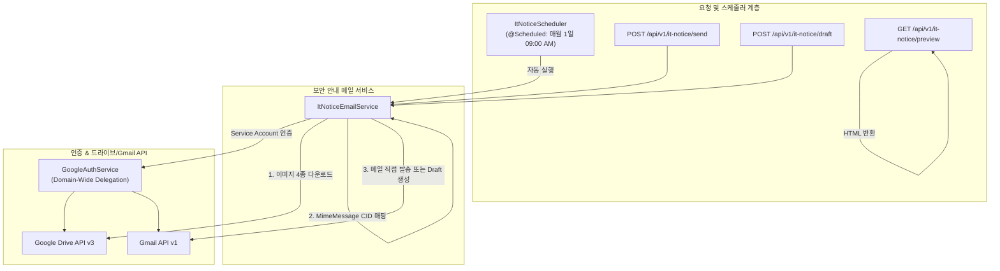

# FATES 사내 IT 정기 보안 안내 메일 시스템 상세 설계서
## (IT Security Notice Mail System Specification)

**문서 버전**: v1.1.0  
**작성일**: 2026-09-04  
**시스템명**: FATES IT Security Notice Automation Subsystem  
**개발 환경**: Java 17, Spring Boot 4.x / Gradle  
**대상 리포지토리**: `fates-system`

---

## 1. 개요 (System Overview)

### 1.1 배경 및 목적
기존 Google Apps Script(GAS) `sendITNoticeMail()` 기반으로 개별 동작하던 **사내 IT 정기 보안 안내 메일 발송 프로세스**를 `fates-system` 백엔드로 이관 및 내재화하였습니다.
매월 1일 오전 9시 정각에 자동으로 실행되는 스케줄러를 탑재하여, Google Drive에 저장된 보안 교육/주의사항 이미지 4종을 인라인(CID) 이미지로 포함한 다언어 보안 안내 메일을 수신자 및 사내 각 부서 참조자에게 자동으로 직접 발송합니다.

### 1.2 주요 기능
1. **매월 1일 정기 자동 발송 스케줄러**: Spring `@Scheduled` 기반 cron (`0 0 9 1 * *`)으로 매월 1일 09:00 AM 자동 실행 (`ItNoticeScheduler`).
2. **Google Drive 보안 이미지 동적 다운로드**: GCP Service Account 도메인 위임 권한을 통해 드라이브 내 4개 이미지(`image1Id` ~ `image4Id`)를 메모리로 다운로드.
3. **CID 인라인 미디어 매핑 (MIME `related`)**: 메일 본문 내 `` 구조로 이미지를 직접 포함시켜 수신자의 외부 이미지 차단 방어.
4. **동적 날짜 매핑 및 제목 구성**: 메일 생성 시점의 날짜(`yyyy.MM.dd`)를 추출하여 `<INTERNAL> PC 및 자료 관리에 대한 정기 안내 (yyyy.MM.dd)` 형태의 메일 제목 자동 부여.
5. **다중 수신자/참조자 자동 설정**: 수신자(`yjchoi@fatesinc.com`) 및 15개 영업/운송/계정 부서 참조자(CC) 자동 매핑.
6. **웹 브라우저 미리보기 및 REST API**: `GET /api/v1/it-notice/preview`를 통한 HTML 실시간 미리보기, `POST /api/v1/it-notice/send`를 통한 수동 즉시 발송, `POST /api/v1/it-notice/draft`를 통한 임시보관함 생성 지원.

---

## 2. 시스템 아키텍처 및 데이터 흐름 (Architecture & Workflow)



---

## 3. 핵심 컴포넌트 명세 (Component Specifications)

### 3.1 `ItNoticeScheduler`
- **위치**: `com.example.fates_system.scheduler.ItNoticeScheduler`
- **주요 기능**: `@Scheduled(cron = "${fates.it-notice.cron:0 0 9 1 * *}")` 매월 1일 09:00 AM 자동 실행.

### 3.2 `ItNoticeEmailService`
- **위치**: `com.example.fates_system.service.ItNoticeEmailService`
- **주요 기능**:
  - `sendItNoticeEmail()`: Google Drive 파일 다운로드 -> `MimeMultipart("related")` -> `Gmail.users().messages().send()` 직접 전송.
  - `createItNoticeDraft()`: Google Drive 파일 다운로드 -> `MimeMultipart("related")` -> `Gmail.users().drafts().create()` 초안 생성.
  - `downloadDriveFile(fileId)`: `GoogleAuthService.getDriveClient()`를 통해 지정된 ID의 파일 바이너리 스트림 읽기.
  - `buildHtmlBody()`: 일어/한국어 사내 보안 안내문, 캘린더 주의사항, PC 바탕화면 및 파일 다운로드 지양, Windows 업데이트 권장 내용 및 CID 이미지 HTML 생성.

### 3.3 `ItNoticeController`
- **위치**: `com.example.fates_system.controller.ItNoticeController`
- **엔드포인트**:
  - `POST /api/v1/it-notice/send`: IT 보안 안내 메일 즉시 직접 전송 (JSON 응답: `messageId`, `status`)
  - `POST /api/v1/it-notice/draft`: IT 보안 안내 메일 초안 생성 (JSON 응답: `draftId`, `status`)
  - `GET /api/v1/it-notice/preview`: 브라우저에서 메일 HTML 본문 실시간 미리보기 (`text/html;charset=UTF-8`)

---

## 4. 환경 설정 명세 (`application.yml`)

```yaml
fates:
  it-notice:
    enabled: true
    cron: "0 0 9 1 * *" # 매달 1일 오전 9시 정각 자동 전송
    sender: "cloud@fatesinc.com"
    recipient: "yjchoi@fatesinc.com"
    cc-recipients: "mocomotoko@fatesinc.com,airimport@fatesinc.com,airexport@fatesinc.com,seaimport@fatesinc.com,seaexport@fatesinc.com,account1@fatesinc.com,bl@fatesinc.com,pearlsim@fatesinc.com,layla@fatesinc.com,ikeda@fatesinc.com,mia@fatesinc.com,tf@fatesinc.com,azamino.ltd@gmail.com,sales@fatesinc.com,cloud@fatesinc.com"
    image1-id: "1cvvBZIYxJIgicwjJDpxj0VLBuqPYymtx"
    image2-id: "1eW6KyZxDppJ-AuY5T4vuE50RqNL9UDRc"
    image3-id: "11gdrrUghvJAb6EIJW8XM52eFZWNvBmT6"
    image4-id: "1mUgHabKGmBexebKVdjTKmQSdA7AQi6MA"
```

---

## 5. REST API 명세서

### 5.1 IT 보안 안내 메일 수동 즉시 발송
- **Method**: `POST`
- **URL**: `/api/v1/it-notice/send`
- **응답 (Response 200 OK)**:
```json
{
  "status": "SUCCESS",
  "messageId": "191a82f7c0012345",
  "message": "IT notice email sent successfully"
}
```

### 5.2 IT 보안 안내 메일 임시보관함 생성
- **Method**: `POST`
- **URL**: `/api/v1/it-notice/draft`
- **응답 (Response 200 OK)**:
```json
{
  "status": "SUCCESS",
  "draftId": "r-1234567890987654321",
  "message": "IT notice draft created successfully in Gmail"
}
```

### 5.3 메일 본문 HTML 미리보기
- **Method**: `GET`
- **URL**: `/api/v1/it-notice/preview`
- **응답**: `text/html;charset=UTF-8` 웹 페이지
