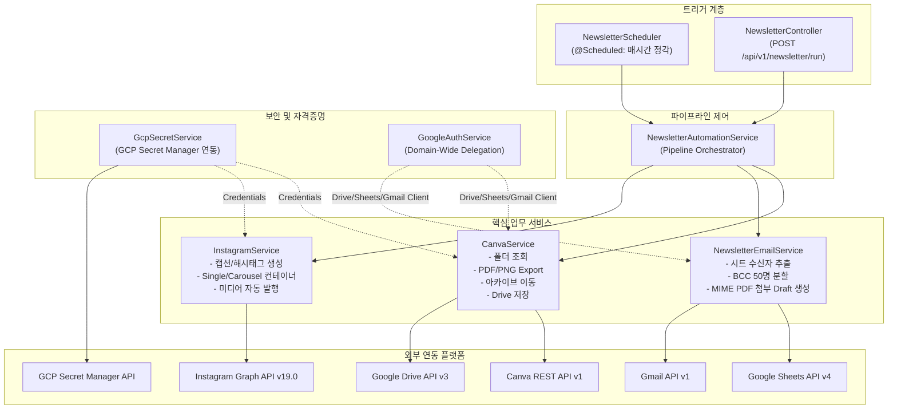
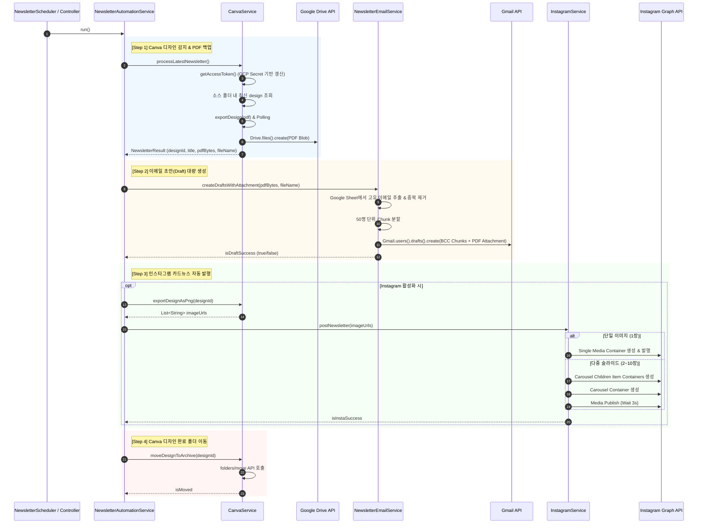

# FATES 뉴스레터 & 인스타그램 자동 발행 시스템 상세 설계서
## (Newsletter & Instagram Automation System Design Specification)

**문서 버전**: v1.0.0  
**작성일**: 2026-08-27  
**시스템명**: FATES Newsletter & Instagram Automation Subsystem  
**개발 환경**: Java 17, Spring Boot 4.x / Gradle  
**대상 리포지토리**: `fates-system`

---

## 1. 시스템 개요 (System Overview)

### 1.1 배경 및 목적
기존 Google Apps Script(GAS)로 분산 처리되던 **Canva 뉴스레터 감지, Google Drive PDF 백업, Gmail 고객 대량 임시보관함(BCC) 생성 및 Instagram 자동 포스팅 파이프라인**을 Spring Boot 백엔드 시스템(`fates-system`)으로 완전 이관 및 통합합니다.

### 1.2 주요 목표
1. **중앙 집중식 통합 관리**: 메일 서명 동기화 시스템과 뉴스레터/SNS 자동화 시스템을 단일 스프링 부트 애플리케이션에서 일원화하여 관리.
2. **안전한 자격증명 관리**: Canva OAuth 자격증명 및 Refresh Token, Instagram Graph API 토큰을 **GCP Secret Manager**를 통해 안전하게 동적 로드.
3. **완전 자동화 & 수동 트리거 지원**: `@Scheduled` 기반 매시간 정기 폴링 및 관리자용 REST API(`POST /api/v1/newsletter/run`) 동시 제공.
4. **견고한 예외 격리**: Instagram 포스팅 실패 시에도 드라이브 백업, 이메일 초안 생성 및 Canva 아카이브 이동 등 독립적 단계의 정상 완료 보장.

---

## 2. 시스템 아키텍처 (System Architecture)

### 2.1 전체 파이프라인 흐름도 (Mermaid)



---

## 3. 실행 프로세스 및 시퀀스 다이어그램 (Process Sequence)



---

## 4. 컴포넌트별 상세 명세 (Component Specifications)

### 4.1 `GcpSecretService`
- **역할**: GCP Secret Manager에서 Canva Client/Refresh Token 및 Instagram Token을 실시간 로드.
- **주요 메서드**:
  - `loadSecret(secretName)`: GCP Secret Manager에서 UTF-8 시크릿 문자열 추출
  - `getCanvaCredentials()`: `client_id`, `client_secret`, `canva_refresh_token` DTO 매핑
  - `getInstagramCredentials()`: `instagram_account_id`, `instagram_access_token` DTO 매핑

### 4.2 `CanvaService`
- **역할**: Canva REST API v1 연동 및 Google Drive 파일 저장.
- **주요 기능**:
  - `processLatestNewsletter()`: 소스 폴더(`FAHSsO0H6ZA`)에서 수정일 기준 최신 디자인을 조회하고 PDF 변환 후 Google Drive 폴더(`1VLv23Hg5sl5Nd8kztGPnAfNj7a1J1C5R`)에 저장.
  - `exportDesign(accessToken, designId, formatType)`: 비동기 Export Job 생성 후 최대 15회(2초 간격) 상태 폴링.
  - `moveDesignToArchive(designId)`: 완료된 디자인을 아카이브 폴더(`FAF7F_uQVOI`)로 이동.

### 4.3 `NewsletterEmailService`
- **역할**: 구글 시트 기반 수신자 목록 추출 및 PDF 첨부 메일 초안 생성.
- **주요 기능**:
  - `extractUniqueEmails()`: 지정된 스프레드시트(`1-yK3rYddxNqp3SPVyX7yYLTSr3psUGZUSMukbPui2bg`)의 전체 시트/열을 탐색하여 정규식 검증 후 고유 이메일 Set 수집.
  - `buildSubject()` / `buildHtmlBody()`: 해당 연도/월/주차 동적 계산 제목 및 표준 일본물류레터 HTML 본문 구성.
  - `buildDraft()`: `jakarta.mail.internet.MimeMessage`를 활용하여 `multipart/mixed` 형식으로 HTML 본문 및 PDF 바이트 배열을 첨부하여 `no-reply@fatesinc.com` 계정의 Gmail 임시보관함 생성.
  - `BCC Chunking`: Gmail 발송 한도 및 스팸 방지를 위해 50명 단위로 분할하여 초안 생성.

### 4.4 `InstagramService`
- **역할**: Meta Graph API v19.0을 이용한 카드뉴스 피드 자동 게시.
- **주요 기능**:
  - `buildCaption()`: 주차별 맞춤 한/일 안내 문구 및 물류/포워딩 필수 해시태그 생성.
  - `createSingleMediaContainer()` / `createCarouselContainer()`: 이미지 수량에 따라 Single Image Feed 또는 최대 10장의 Carousel Container 자동 구성.
  - `publishMedia()`: `media_publish` 엔드포인트를 호출하여 인스타그램 비즈니스 계정에 자동 게시.

### 4.5 `NewsletterAutomationService`
- **역할**: 전체 파이프라인 조율 오케스트레이터.
- **순차 처리 로직**:
  1. `CanvaService.processLatestNewsletter()` (실패 시 전체 중단)
  2. `NewsletterEmailService.createDraftsWithAttachment()` (실패 시 후속 작업 중단)
  3. `InstagramService.postNewsletter()` (실패하더라도 로그 기록 후 4단계로 진행)
  4. `CanvaService.moveDesignToArchive()` (최종 이동)

### 4.6 `NewsletterScheduler` & `NewsletterController`
- **스케줄러**: `@Scheduled(cron = "${fates.newsletter.cron:0 0 * * * *}")` 매시간 정각 자동 감지 및 실행 (`fates.newsletter.enabled=true` 시에만 동작).
- **REST 컨트롤러**: `POST /api/v1/newsletter/run` 관리자 즉시 수동 실행 API 제공.

---

## 5. 설정 및 보안 데이터 명세 (Configuration Spec)

### 5.1 `application.yml` 프로퍼티 명세
```yaml
fates:
  newsletter:
    enabled: true
    cron: "0 0 * * * *" # 매시간 정각 실행
    canva:
      source-folder-id: "FAHSsO0H6ZA"      # 작업 대기 폴더
      archive-folder-id: "FAF7F_uQVOI"     # 완료 보관 폴더
      max-poll-attempts: 15
      poll-interval-ms: 2000
    instagram:
      enabled: true
      api-version: "v19.0"
      max-carousel-items: 10
      publish-wait-ms: 3000
    email:
      spreadsheet-id: "1-yK3rYddxNqp3SPVyX7yYLTSr3psUGZUSMukbPui2bg"
      sender: "no-reply@fatesinc.com"
      draft-target: "no-reply@fatesinc.com"
      bcc-chunk-size: 50
    drive:
      folder-id: "1VLv23Hg5sl5Nd8kztGPnAfNj7a1J1C5R" # PDF 저장 대상 폴더
```

### 5.2 GCP Secret Manager JSON 구조 명세
GCP Secret Manager의 `sec-7f9a2b8c3d` (또는 지정 Secret) 내 JSON 페이로드 구조:
```json
{
  "client_id": "<CANVA_OAUTH_CLIENT_ID>",
  "client_secret": "<CANVA_OAUTH_CLIENT_SECRET>",
  "canva_refresh_token": "<CANVA_OAUTH_REFRESH_TOKEN>",
  "instagram_account_id": "<INSTAGRAM_BUSINESS_ACCOUNT_ID>",
  "instagram_access_token": "<INSTAGRAM_GRAPH_API_LONG_LIVED_TOKEN>"
}
```

---

## 6. 예외 처리 및 안정성 보장 전략 (Reliability & Fault-Tolerance)

1. **단계별 독립성 및 장애 격리 (Fault Isolation)**:
   - Instagram API 연동 장애나 Meta 서버 일시 지연이 발생하더라도, 핵심 업무인 **Google Drive PDF 백업, Gmail 초안 생성, Canva 아카이브 이동**은 중단 없이 정상 완료됩니다.
2. **Export Polling 타임아웃 방어**:
   - Canva의 비동기 렌더링 작업 시 `MAX_POLL_ATTEMPTS(15회)` 및 `POLL_INTERVAL_MS(2초)`를 설정하여 최대 30초 내 변환 실패 시 무한 루프 없이 안전하게 에러 로깅 후 종료합니다.
3. **BCC 대량 발송 분할 (Spam & Quota Defense)**:
   - 수백 명 이상의 고객 수신자가 존재할 경우, Gmail 발송 정책을 준수하기 위해 `BCC_CHUNK_SIZE(50명)` 단위로 나누어 임시보관함(Draft)을 생성합니다.
4. **특수문자 및 파일명 정제 (Sanitization)**:
   - Canva 디자인 제목에 포함될 수 있는 파일 시스템 금칙 문자(`/`, `\`, `:`, `*`, `?`, `"`, `<`, `>`, `|`)를 자동으로 `_`로 치환하여 파일 생성 오류를 방지합니다.

---

## 7. 운영 및 테스트 가이드 (Operations Guide)

### 7.1 수동 즉시 실행 (cURL)
```bash
curl -X POST http://localhost:8080/api/v1/newsletter/run
```

### 7.2 서비스 계정 필수 Google 권한 (Scopes)
- `https://www.googleapis.com/auth/gmail.compose` (임시보관함 생성)
- `https://www.googleapis.com/auth/spreadsheets` (수신자 목록 조회)
- `https://www.googleapis.com/auth/drive.file` (PDF 파일 업로드)
