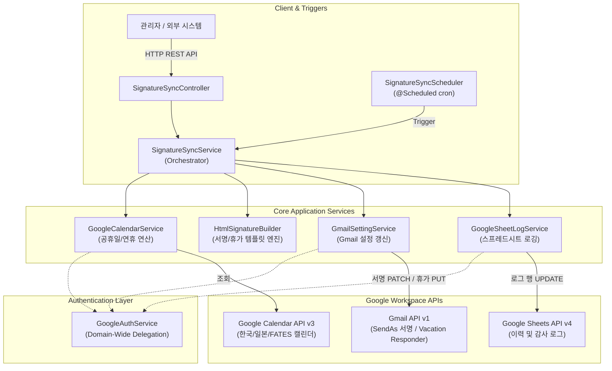
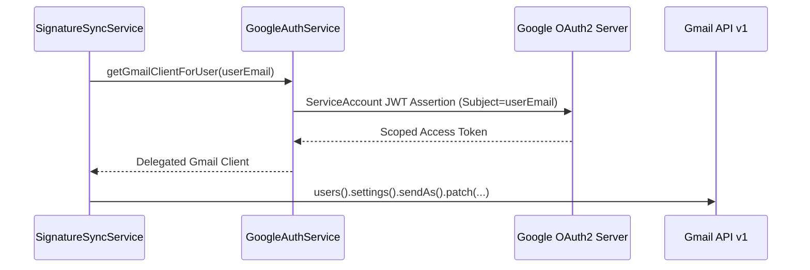
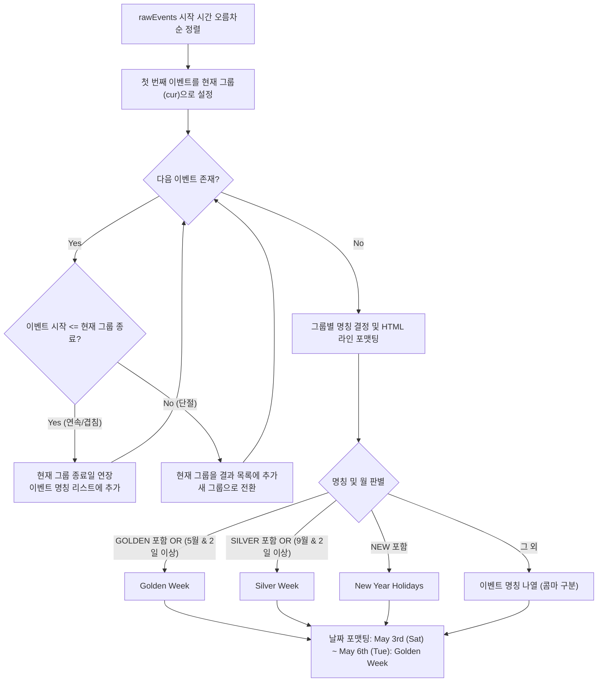

# FATES 메일 서명 & 부재중 자동응답 시스템 상세 설계서 (System Design Specification)

**문서 버전**: v1.0.0  
**작성일**: 2026-08-25  
**시스템명**: FATES Signature & Vacation Sync Backend System (`fates-system`)  
**개발 환경**: Java 17, Spring Boot 4.x / Gradle  

---

## 1. 시스템 개요 (System Overview)

### 1.1 배경 및 목적
기존 Google Apps Script(GAS) 기반 스크립트와 외부 웹훅(Make.com) 연동 방식으로 분산 운영되던 사내 자동화 업무들을 **자체 Spring Boot 통합 백엔드 애플리케이션(`fates-system`)으로 전환 및 내재화**합니다.

본 시스템은 크게 3개의 핵심 서브시스템으로 구성됩니다:
1. **서브시스템 1: Gmail 서명 & 부재중 자동응답 동기화 (Signature & Vacation Sync)**
   - 캘린더 공휴일/연휴 자동 계산, 그룹별 HTML 서명 갱신 및 Gmail 부재중 자동응답 설정.
2. **서브시스템 2: Canva 뉴스레터 & 인스타그램 자동 발행 (Newsletter & Instagram Automation)**
   - Canva 신규 디자인 감지, Google Drive PDF 백업, 구글 시트 기반 대량 BCC 이메일 초안 생성 및 Instagram 카드뉴스 피드 자동 포스팅.
   - *상세 설계*: [newsletter_automation_design_specification.md](./newsletter_automation_design_specification.md) 참조.
3. **서브시스템 3: 사내 IT 정기 보안 안내 메일 자동 생성 (IT Security Notice Automation)**
   - Google Drive 내 보안 안내 이미지 4종 동적 다운로드, CID 인라인 미디어 매핑, 다언어 본문 및 Gmail 임시보관함(Draft) 자동 생성.
   - *상세 설계*: [it_notice_automation_design_specification.md](./it_notice_automation_design_specification.md) 참조.

---

## 2. 시스템 아키텍처 (System Architecture)

### 2.1 전체 시스템 블록 다이어그램



---

### 2.2 계층 구조 및 역할 정의

| 계층 (Layer) | 패키지 / 클래스 | 역할 및 책임 |
| :--- | :--- | :--- |
| **Presentation** | `controller.SignatureSyncController` | 동기화 실행, 상태 조회, HTML 서명 및 공휴일 미리보기 REST API 제공 |
| **Scheduler** | `scheduler.SignatureSyncScheduler` | 설정된 cron 주기에 따라 자동으로 동기화 작업을 트리거 |
| **Orchestration** | `service.SignatureSyncService` | 공휴일 계산 → 템플릿 가공 → 계정별 Gmail API 호출 → 시트 로깅의 전체 파이프라인 조율 |
| **Business Logic** | `service.GoogleCalendarService`<br>`service.HtmlSignatureBuilder` | 캘린더 이벤트 필터링/병합, 복귀일 계산, 그룹별 HTML 서식 생성 및 정규식 치환 |
| **Infrastructure** | `service.GmailSettingService`<br>`service.GoogleSheetLogService`<br>`service.GoogleAuthService` | Google API Client 라이브러리 연동 및 Service Account 도메인 위임 인증 처리 |
| **Configuration** | `config.AppProperties` | `application.yml` 프로퍼티(계정 목록, 그룹, 캘린더 ID, 스케줄 등) 바인딩 |

---

## 3. 핵심 모듈 상세 설계 (Detailed Component Design)

### 3.1 Google 인증 및 도메인 위임 (`GoogleAuthService`)

- **인증 메커니즘**:
  - Service Account 비공개 키(`service-account.json` 또는 환경변수 `GOOGLE_PRIVATE_KEY`)를 로드.
  - 각 대상 사용자(`userEmail`)별로 **Domain-Wide Delegation(도메인 전체 위임)**을 수행하여 해당 사용자의 권한으로 세션 생성(`createDelegated(userEmail)`).
- **요구 권한(OAuth2 Scopes)**:
  - `https://www.googleapis.com/auth/gmail.settings.basic`
  - `https://www.googleapis.com/auth/gmail.settings.sharing`
  - `https://www.googleapis.com/auth/calendar.readonly`
  - `https://www.googleapis.com/auth/spreadsheets`



---

### 3.2 공휴일 연산 및 연휴 병합 엔진 (`GoogleCalendarService`)

#### 1) 캘린더 이벤트 수집 및 필터링
- **조회 대상**: 기준일로부터 향후 3개월 범위
  - 한국 캘린더: `en.south_korea#holiday@group.v.calendar.google.com`
  - 일본 캘린더: `en.japanese#holiday@group.v.calendar.google.com`
  - FATES 전용 캘린더: `c_59413484b7a70585537d0853abb0b031e1b5124bff359f9519235fd99c0b43f4@group.calendar.google.com`
- **필터링 조건**:
  - 주말(토요일/일요일) 제외
  - 기념일 리스트(`SKIP_HOLIDAYS`: Mother's Day, Valentine's Day, Star Festival 등) 제외
  - FATES 캘린더는 이벤트 제목에 `GOLDEN`, `SILVER`, `NEW`가 포함된 경우만 수집

#### 2) 연속 공휴일 병합 및 명칭 결정 알고리즘



#### 3) 복귀일(`Resume Date`) 계산 알고리즘
- 가장 가까운 연휴의 종료일(`nearestEnd`) 기준:
  - 연휴 종료일이 **토요일**인 경우: **+2일 (월요일)**
  - 연휴 종료일이 **일요일**인 경우: **+1일 (월요일)**
  - 연휴 종료일이 **평일**인 경우: 당일 정상 복귀

---

### 3.3 서명 및 부재중 HTML 템플릿 엔진 (`HtmlSignatureBuilder`)

#### 1) 계정 그룹별 서명 템플릿 분기
- **`BL1` (`bl1@fatesinc.com`)**:
  - 상단에 공휴일 블록 배치 후 전용 서식(`<span style="color: #000000; font-family: arial...">`) 적용
- **`BAF` (`seaimp2@...`, `seaimp3@...`)**:
  - `BAF_PATTERN` 정규식을 활용하여 `도착지 BAF 요금` 문구 직전의 기존 공휴일 안내문을 새 블록으로 치환
- **`SEAIMP1` (`seaimp1@...`)**:
  - 마츠모토 전용 인사말(`감사합니다. / よろしくお願いいたします。 / FATES / 松本 마츠모토 드림 MATSUMOTO`)을 서명 상단에 배치하고 BAF 패턴 치환
- **`기본(Default)` (`cloud@fatesinc.com` 등)**:
  - 기존 `**HOLIDAY NOTICE**`가 있으면 교체, 없으면 `株式会社FATES` 또는 `(ファテス)` 직전에 삽입

#### 2) 정규표현식 정의

| 패턴 식별자 | Regex 표현식 | 설명 |
| :--- | :--- | :--- |
| `NOTICE_PATTERN` | `<span[^>]*>\s*\*\*HOLIDAY NOTICE\*\*[\s\S]*?</span>(?:<br\s*/?>)*` | 기존 서명에 포함된 공휴일 안내문 블록 감지 |
| `COMPANY_PATTERN` | `株式会社FATES\|\\(ファテス\\)` | 회사명 표기 위치 감지 (삽입 기준점) |
| `BAF_PATTERN` | `[\s\S]*?\*\*HOLIDAY NOTICE\*\*[\s\S]*?(?=(?:<[^>]+>\|\s)*●?(?:<[^>]+>\|\s)*도착지(?:<[^>]+>\|\s)*[Bb][Aa][Ff](?:<[^>]+>\|\s)*요\s*금)` | BAF 요금 안내 섹션 직전의 공휴일 안내문 감지 |

---

## 4. API 명세서 (REST API Specification)

### 4.1 전체 계정 동기화 실행
- **URL**: `POST /api/v1/sync/run`
- **설명**: `application.yml`에 등록된 전체 대상 계정에 대해 공휴일 조회, 서명 PATCH, 부재중 설정 PUT 및 시트 로깅을 실행합니다.
- **응답 (Response 200 OK)**:
```json
{
  "totalAccounts": 1,
  "successCount": 1,
  "failureCount": 0,
  "startedAt": "2026-08-25T09:20:00.123",
  "finishedAt": "2026-08-25T09:20:05.456",
  "results": [
    {
      "email": "cloud@fatesinc.com",
      "signatureStatus": "success",
      "signatureError": null,
      "newSignature": "<span style=\"color: red; ...\">**HOLIDAY NOTICE**<br>...</span>",
      "vacationStatus": "success",
      "vacationError": null,
      "vacationSettings": {
        "enableAutoReply": true,
        "responseSubject": "Holiday Notice",
        "responseBodyHtml": "<span style=\"color: red;\">**HOLIDAY NOTICE**...</span>",
        "startTime": "1777766400000",
        "endTime": "1778112000000",
        "restrictToDomain": false,
        "restrictToContacts": false
      },
      "timestamp": "2026-08-25T09:20:04.120",
      "error": null
    }
  ]
}
```

---

### 4.2 단일 계정 동기화 실행
- **URL**: `POST /api/v1/sync/run/{email}`
- **Path Parameter**: `email` (예: `cloud@fatesinc.com`)
- **응답 (Response 200 OK)**: `SyncAccountResult` 단일 객체 반환

---

### 4.3 공휴일 및 부재중 설정 미리보기
- **URL**: `GET /api/v1/holidays/preview`
- **Query Parameter**: `isKorea` (boolean, default: `false`)
- **응답 (Response 200 OK)**:
```json
{
  "hasHolidays": true,
  "finalNoticeText": "May 3rd (Sun) ~ May 6th (Wed): Golden Week",
  "nearestNoticeText": "May 3rd (Sun) ~ May 6th (Wed): Golden Week",
  "nearestStart": "2026-05-03T00:00:00+09:00",
  "nearestEnd": "2026-05-07T00:00:00+09:00",
  "resumeDate": "2026-05-07"
}
```

---

### 4.4 서명 변환 미리보기
- **URL**: `POST /api/v1/signatures/preview`
- **요청 Body (Request JSON)**:
```json
{
  "email": "seaimp1@fatesinc.com",
  "originalSignature": "<p>기존 서명 본문</p>● 도착지 BAF 요금 안내"
}
```
- **응답 (Response 200 OK)**:
```json
{
  "email": "seaimp1@fatesinc.com",
  "groupType": "SEAIMP1",
  "holidayNotice": "May 3rd (Sun) ~ May 6th (Wed): Golden Week",
  "originalSignature": "<p>기존 서명 본문</p>● 도착지 BAF 요금 안내",
  "previewSignature": "<span style=\"color: black;\">감사합니다...</span><span style=\"color: red;\">**HOLIDAY NOTICE**...</span>● 도착지 BAF 요금 안내",
  "vacationHtml": "<span style=\"color: red;\">**HOLIDAY NOTICE**...</span><br><br>Resume on May 7th, 2026<br>Fates Inc.",
  "resumeDate": "2026-05-07"
}
```

---

## 5. 데이터 모델 및 설정 명세 (Configuration Spec)

### 5.1 설정 파일 명세 (`application.yml`)

```yaml
spring:
  application:
    name: fates-system

fates:
  google:
    service-account-key-path: ${GOOGLE_APPLICATION_CREDENTIALS:credentials/service-account.json}
    service-account-email: ${GOOGLE_SERVICE_ACCOUNT_EMAIL:}
    private-key: ${GOOGLE_PRIVATE_KEY:}
  
  calendars:
    korea: "en.south_korea#holiday@group.v.calendar.google.com"
    japan: "en.japanese#holiday@group.v.calendar.google.com"
    custom: "c_59413484b7a70585537d0853abb0b031e1b5124bff359f9519235fd99c0b43f4@group.calendar.google.com"

  target-emails:
    - "cloud@fatesinc.com"

  groups:
    seaimp1:
      - "seaimp1@fatesinc.com"
    baf:
      - "seaimp2@fatesinc.com"
      - "seaimp3@fatesinc.com"
    bl1:
      - "bl1@fatesinc.com"

  skip-holidays:
    - "Mother's Day"
    - "Father's Day"
    - "Valentine's Day"
    - "White Day"
    - "Christmas Eve"
    - "Halloween"
    - "Labor Day"
    - "Parents' Day"
    - "Parent's Day"
    - "Teachers' Day"
    - "Teacher's Day"
    - "Armed Forces Day"
    - "United Nations Day"
    - "Martyrs' Day"
    - "Star Festival"

  log-sheet-id: "1HFbTeqLVC6lplLbCxFNzluauWxTSqG6RZcjsKDfO7uo"

  scheduler:
    enabled: true
    cron: "0 0 1 * * *" # 매일 새벽 01:00 실행
```

---

## 6. 장애 대응 및 안정성 보장 전략 (Reliability & Error Handling)

1. **계정 간 지연 처리 (Rate-Limiting Defense)**:
   - 계정 처리 루프 사이에 `Thread.sleep(3000)`을 적용하여 Google API 쿼터(Quota) 초과(429 Too Many Requests) 방어.
2. **계정별 독립 예외 격리 (Fault Isolation)**:
   - 특정 사용자의 OAuth2 권한 오류나 서명 파싱 오류가 발생하더라도 `try-catch`로 포획하여 해당 계정만 `fail` 기록 후 다음 계정 처리를 지속.
3. **감사 추적 및 로깅 (Audit Logging)**:
   - Google Sheet (`LOG_SHEET_ID`)의 해당 이메일 행을 탐색하여 B열에 실행 결과 JSON 전문을 기록하고 C열에 실행 일자를 기록.

---

## 7. 운영 및 유지보수 가이드 (Operations Guide)

### 7.1 Google Cloud 사전 준비사항
1. GCP 콘솔에서 **Service Account** 생성 및 JSON 키 발급 (`credentials/service-account.json`).
2. Google Workspace 관리자 콘솔 (`admin.google.com`) > 보안 > API 제어 > **도메인 전체 위임(Domain-Wide Delegation)** 메뉴에서 Service Account의 Client ID를 등록하고 아래 Scope를 허용:
   - `https://www.googleapis.com/auth/gmail.settings.basic`
   - `https://www.googleapis.com/auth/gmail.settings.sharing`
   - `https://www.googleapis.com/auth/calendar.readonly`
   - `https://www.googleapis.com/auth/spreadsheets`

### 7.2 빌드 및 실행
```bash
# 1. 단위 테스트 실행
./gradlew test

# 2. 실행 가능한 jar 파일 빌드
./gradlew bootJar

# 3. 애플리케이션 실행
java -jar build/libs/fates-system-0.0.1-SNAPSHOT.jar
.\gradlew.bat bootRun
```
