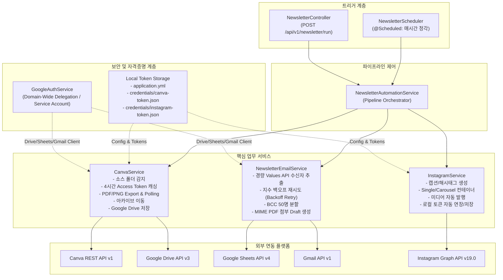

# FATES 뉴스레터 & 인스타그램 자동 발행 시스템 상세 설계서
## (Newsletter & Instagram Automation System Design Specification)

**문서 버전**: v1.1.0  
**작성일**: 2026-09-08 (최종 개정)  
**시스템명**: FATES Newsletter & Instagram Automation Subsystem  
**개발 환경**: Java 17, Spring Boot 4.x / Gradle  
**대상 리포지토리**: `fates-system`

---

## 1. 시스템 개요 (System Overview)

### 1.1 배경 및 목적
기존 Google Apps Script(GAS)로 분산 처리되던 **Canva 뉴스레터 감지, Google Drive PDF 백업, Gmail 고객 대량 임시보관함(BCC) 생성 및 Instagram 자동 포스팅 파이프라인**을 Spring Boot 백엔드 시스템(`fates-system`)으로 완전 이관 및 통합합니다.

### 1.2 주요 목표
1. **중앙 집중식 통합 관리**: 메일 서명 동기화 시스템과 뉴스레터/SNS 자동화 시스템을 단일 스프링 부트 애플리케이션에서 일원화하여 관리.
2. **자격증명 관리 간소화 및 로컬 격리**: Canva OAuth 자격증명 및 Refresh Token, Instagram Graph API 토큰을 로컬 설정(`application.yml`) 및 전용 파일(`credentials/*.json`)로 완전 격리하여 불필요한 GCP Secret Manager 버전 누적 및 외부 인증 오류를 원천 차단. (GCP Secret Manager는 서명 변경용 Google 서비스 계정 전용으로 분리)
3. **Canva Access Token 4시간 인메모리 캐싱**: 4시간 동안 유효한 Canva Access Token을 메모리에 캐싱하여 매 실행 시마다 발생하던 중복 토큰 갱신 네트워크 부하를 제거.
4. **경량 Google Sheets API 연동**: 대량 수신자 목록 추출 시 서식/스타일 오버헤드가 큰 `includeGridData=true` 대신 경량 `values().get()` 및 지수 백오프(Exponential Backoff) 재시도 로직을 적용하여 503 `backendError` 완벽 예방.
5. **완전 자동화 & 수동 트리거 지원**: `@Scheduled` 기반 매시간 정기 폴링 및 관리자용 REST API(`POST /api/v1/newsletter/run`) 동시 제공.
6. **견고한 예외 격리**: Instagram 포스팅 실패 시에도 드라이브 백업, 이메일 초안 생성 및 Canva 아카이브 이동 등 독립적 단계의 정상 완료 보장.

---

## 2. 시스템 아키텍처 (System Architecture)

### 2.1 전체 파이프라인 흐름도 (Mermaid)



---

## 3. 실행 프로세스 및 시퀀스 다이어그램 (Process Sequence)

```mermaid
sequenceDiagram
    autonumber
    participant Sched as NewsletterScheduler / Controller
    participant Auto as NewsletterAutomationService
    participant Canva as CanvaService
    participant Drive as Google Drive API
    participant Email as NewsletterEmailService
    participant Gmail as Gmail API
    participant Insta as InstagramService
    participant Meta as Instagram Graph API

    Sched->>Auto: run()
    
    rect rgb(240, 248, 255)
        note right of Auto: [Step 0 & 1] Canva 디자인 감지 & PDF 백업
        Auto->>Canva: checkSourceFolderForDesign()
        Canva->>Canva: getAccessToken() (4시간 인메모리 캐시 확인; 만료 시 로컬 파일 기반 갱신)
        alt 소스 폴더에 처리 대상 디자인 없음
            Canva-->>Auto: null (조용히 종료, 후속 단계 건너뜀)
        else 신규 디자인 감지됨
            Auto->>Canva: processDesign(latestDesign)
            Canva->>Canva: exportDesign(pdf) & 비동기 상태 Polling
            Canva->>Drive: Drive.files().create(PDF Blob)
            Canva-->>Auto: NewsletterResult (designId, title, pdfBytes, fileName)
        end
    end

    rect rgb(255, 250, 240)
        note right of Auto: [Step 2] 이메일 초안(Draft) 대량 생성
        Auto->>Email: createDraftsWithAttachment(pdfBytes, fileName)
        Email->>Email: 경량 Values API(values().get)로 수신자 추출 (재시도 로직 내장)
        Email->>Email: 고유 이메일 Set 수집 & 50명 단위 BCC Chunk 분할
        Email->>Gmail: Gmail.users().drafts().create(BCC Chunks + PDF Attachment)
        Email-->>Auto: isDraftSuccess (true/false)
    end

    rect rgb(245, 255, 245)
        note right of Auto: [Step 3] 인스타그램 카드뉴스 자동 발행
        opt Instagram 활성화 시
            Auto->>Canva: exportDesignAsPng(designId)
            Canva-->>Auto: List<String> imageUrls
            Auto->>Insta: postNewsletter(imageUrls)
            Insta->>Insta: 로컬 토큰 로드 및 만료 확인
            alt 단일 이미지 (1장)
                Insta->>Meta: Single Media Container 생성 & 발행
            else 다중 슬라이드 (2~10장)
                Insta->>Meta: Carousel Children Item Containers 생성
                Insta->>Meta: Carousel Container 생성
                Insta->>Meta: Media Publish (Wait 3s)
            end
            Insta-->>Auto: isInstaSuccess
        end
    end

    rect rgb(255, 245, 245)
        note right of Auto: [Step 4] Canva 디자인 완료 폴더 이동
        Auto->>Canva: moveDesignToArchive(designId)
        Canva->>Canva: folders/move API 호출
        Canva-->>Auto: isMoved
    end
```

---

## 4. 컴포넌트별 상세 명세 (Component Specifications)

### 4.1 로컬 자격증명 관리 (Local Token Storage & Caching)
- **설계 원칙**: 외부 GCP Secret Manager 의존성을 배제하고, 로컬 설정 파일 및 전용 JSON 파일로 자격증명을 관리하여 안정성을 보장.
- **Canva 토큰 파일 (`credentials/canva-token.json`)**:
  - `client_id`, `client_secret`, 최신 순환된 `refresh_token` 보관.
  - 토큰 순환 시 로컬 파일에 즉시 업데이트되어 서버 재시작 후에도 연속 유지.
- **Instagram 토큰 파일 (`credentials/instagram-token.json`)**:
  - `account_id`, `access_token` 보관.
- **보안 격리**: `credentials/*.json` 패턴은 `.gitignore`에 등록되어 Git 저장소에 커밋되지 않음.

### 4.2 `CanvaService`
- **역할**: Canva REST API v1 연동 및 Google Drive 파일 저장.
- **주요 기능**:
  - `getAccessToken()`:
    - **4시간 인메모리 캐싱**: `cachedAccessToken`과 `accessTokenExpiresAt`을 통해 4시간 유효 기간 동안은 외부 호출 없이 즉시 캐시 반환.
    - **토큰 갱신 시 로컬 파일 동기화**: 만료 시에만 1회 Refresh Token 호출을 수행하고, 새로 발급된 `refresh_token`을 `credentials/canva-token.json`에 저장.
  - `checkSourceFolderForDesign()`: 소스 폴더(`FAHSsO0H6ZA`)에 새 디자인이 있는지 확인. 없으면 조기 반환.
  - `processDesign(latestDesign)`: 디자인을 PDF로 변환 후 Google Drive 폴더(`1VLv23Hg5sl5Nd8kztGPnAfNj7a1J1C5R`)에 저장.
  - `exportDesign(accessToken, designId, formatType)`: 비동기 Export Job 생성 후 최대 15회(2초 간격) 상태 폴링.
  - `moveDesignToArchive(designId)`: 처리가 완료된 디자인을 아카이브 폴더(`FAF7F_uQVOI`)로 이동.

### 4.3 `NewsletterEmailService`
- **역할**: 구글 시트 기반 수신자 목록 추출 및 PDF 첨부 대량 메일 초안 생성.
- **주요 기능**:
  - `extractUniqueEmails()`:
    - `sheets.spreadsheets().get().setFields("sheets.properties.title")`로 시트 목록 메타데이터만 초경량 조회.
    - `sheets.spreadsheets().values().get(spreadsheetId, range)` 경량 Values API로 셀 서식 없이 텍스트 값만 조회하여 구글 서버 부하 및 503 `backendError` 원천 차단.
    - `executeWithRetry`: 503, 500, 429 등 일시적 서버 오류 발생 시 최대 3회 지수 백오프(1.5초, 3초) 자동 재시도.
  - `buildSubject()` / `buildHtmlBody()`: 해당 연도/월/주차 동적 계산 제목 및 표준 일본물류레터 HTML 본문 구성.
  - `buildDraft()`: `jakarta.mail.internet.MimeMessage`를 활용하여 `multipart/mixed` 형식으로 HTML 본문 및 PDF 바이트 배열을 첨부하여 `no-reply@fatesinc.com` 계정의 Gmail 임시보관함 생성.
  - `BCC Chunking`: Gmail 발송 한도 및 스팸 방지를 위해 50명 단위로 분할하여 초안 생성.

### 4.4 `InstagramService`
- **역할**: Meta Graph API v19.0을 이용한 카드뉴스 피드 자동 게시.
- **주요 기능**:
  - `loadCredentials()` / `saveAccessTokenLocally()`: `AppProperties` 및 `credentials/instagram-token.json`을 통해 토큰 로드/저장.
  - `exchangeAndSaveToken(token)`: 새로 입력받은 토큰을 60일 장기 토큰으로 변환한 후 로컬 파일에 영구 보관.
  - `buildCaption()`: 주차별 맞춤 한/일 안내 문구 및 물류/포워딩 필수 해시태그 생성.
  - `createSingleMediaContainer()` / `createCarouselContainer()`: 이미지 수량에 따라 Single Image Feed 또는 최대 10장의 Carousel Container 자동 구성.
  - `publishMedia()`: `media_publish` 엔드포인트를 호출하여 인스타그램 비즈니스 계정에 자동 게시.

### 4.5 `Cafe24BoardService`
- **역할**: 카페24 공식 홈페이지 게시판(JcBoard) 뉴스레터 자동 등록.
- **주요 기능**:
  - `uploadNewsletter(pdfBytes, fileName, designTitle)`:
    - Canva에서 추출한 PDF 파일을 `ByteArrayResource`로 첨부(`userfile1`).
    - 방안 B에 따른 주차별 한국어 요약 안내 본문 HTML(`buildHtmlBody()`) 구성.
    - `post_lang="ko"`, `pass="0381"`, `name="관리자"`, `tname="guide"`, `mode="write"`, `vmode="Query"` 설정으로 `multipart/form-data` 요청 전송.
    - 게시판 일시 오류 시에도 독립적 예외 격리로 후속 단계 정상 진행 보장.

### 4.6 `NewsletterAutomationService`
- **역할**: 전체 파이프라인 조율 오케스트레이터.
- **순차 처리 로직**:
  1. `CanvaService.checkSourceFolderForDesign()` (소스 폴더 감시; 대상 디자인이 없으면 조용히 조기 종료)
  2. `CanvaService.processDesign()` (PDF 생성 및 Drive 업로드)
  3. `NewsletterEmailService.createDraftsWithAttachment()` (BCC 이메일 초안 생성)
  4. `Cafe24BoardService.uploadNewsletter()` (카페24 공식 웹사이트 게시판 자동 업로드; 활성화 시)
  5. `InstagramService.postNewsletter()` (인스타그램 게시; 활성화 시)
  6. `CanvaService.moveDesignToArchive()` (아카이브 이동)

### 4.7 `NewsletterScheduler` & `NewsletterController`
- **스케줄러**: `@Scheduled(cron = "${fates.newsletter.cron:0 0 * * * *}")` 매시간 정각 자동 감지 및 실행 (`fates.newsletter.enabled=true` 시에만 동작).
- **REST 컨트롤러**:
  - `POST /api/v1/newsletter/run`: 관리자 즉시 수동 실행 API 제공.
  - `POST /api/v1/newsletter/update-instagram-token?token={token}`: 인스타그램 신규 토큰 등록 및 60일 장기 토큰 자동 갱신 API 제공.

---

## 5. 설정 및 로컬 데이터 명세 (Configuration Spec)

### 5.1 `application.yml` 프로퍼티 명세
```yaml
fates:
  newsletter:
    enabled: true
    cron: "0 0 * * * *" # 매시간 정각 실행
    canva:
      client-id: "OC-AaAT3t0A3wr4"
      client-secret: "${CANVA_CLIENT_SECRET:}"
      token-file-path: "credentials/canva-token.json"
      source-folder-id: "FAHSsO0H6ZA"      # 작업 대기 폴더
      archive-folder-id: "FAF7F_uQVOI"     # 완료 보관 폴더
      max-poll-attempts: 15
      poll-interval-ms: 2000
    instagram:
      enabled: true
      api-version: "v19.0"
      account-id: "17841471452286580"
      token-file-path: "credentials/instagram-token.json"
      max-carousel-items: 10
      publish-wait-ms: 3000
    email:
      spreadsheet-id: "1-yK3rYddxNqp3SPVyX7yYLTSr3psUGZUSMukbPui2bg"
      sender: "no-reply@fatesinc.com"
      draft-target: "no-reply@fatesinc.com"
      bcc-chunk-size: 50
    drive:
      folder-id: "1VLv23Hg5sl5Nd8kztGPnAfNj7a1J1C5R" # PDF 저장 대상 폴더
    cafe24:
      enabled: true
      endpoint: "https://fatesinc.mycafe24.com/JcBoard/board_complete.php"
      tname: "guide"
      author: "관리자"
      password: "0381"
      post-lang: "ko"
```

### 5.2 로컬 토큰 파일 구조 명세

#### `credentials/canva-token.json`
```json
{
  "client_id": "OC-AaAT3t0A3wr4",
  "client_secret": "<CANVA_CLIENT_SECRET>",
  "refresh_token": "<CANVA_ROTATED_REFRESH_TOKEN>"
}
```

#### `credentials/instagram-token.json`
```json
{
  "account_id": "17841471452286580",
  "access_token": "<INSTAGRAM_LONG_LIVED_ACCESS_TOKEN>"
}
```

---

## 6. 예외 처리 및 안정성 보장 전략 (Reliability & Fault-Tolerance)

1. **단계별 독립성 및 장애 격리 (Fault Isolation)**:
   - Instagram API 연동 장애나 토큰 만료가 발생하더라도, 핵심 업무인 **Google Drive PDF 백업, Gmail 초안 생성, Canva 아카이브 이동**은 중단 없이 정상 완료됩니다.
2. **4시간 Access Token 재사용으로 안정성 극대화**:
   - Canva의 Access Token을 4시간 동안 인메모리 캐싱하여, 토큰 교환 빈도를 최소화하고 토큰 불일치 문제를 방지합니다.
3. **Google Sheets API 경량화 및 자동 재시도**:
   - 값만 조회하는 경량 `values().get()` 호출 및 503/500/429 발생 시 최대 3회 지수 백오프 재시도를 통해 네트워크 지연이나 구글 일시 서버 오류를 자가 복구합니다.
4. **BCC 대량 발송 분할 (Spam & Quota Defense)**:
   - 수백 명 이상의 고객 수신자가 존재할 경우, Gmail 발송 정책을 준수하기 위해 `BCC_CHUNK_SIZE(50명)` 단위로 나누어 임시보관함(Draft)을 생성합니다.
5. **특수문자 및 파일명 정제 (Sanitization)**:
   - Canva 디자인 제목에 포함될 수 있는 파일 시스템 금칙 문자(`/`, `\`, `:`, `*`, `?`, `"`, `<`, `>`, `|`)를 자동으로 `_`로 치환하여 파일 생성 오류를 방지합니다.

---

## 7. 운영 및 테스트 가이드 (Operations Guide)

### 7.1 수동 즉시 실행 (cURL)
```bash
curl -X POST http://localhost:8080/api/v1/newsletter/run
```

### 7.2 Instagram 토큰 등록 및 60일 장기 토큰 변환
```bash
curl -X POST "http://localhost:8080/api/v1/newsletter/update-instagram-token?token={새로_발급받은_토큰}"
```

### 7.3 Canva 신규 웹 인증 링크 생성 및 콜백
```bash
# 1. 브라우저에서 인증 URL 열기
http://localhost:8080/api/v1/newsletter/canva/auth-url

# 2. 브라우저 로그인 완료 시 /api/v1/newsletter/canva/callback 으로 자동 리다이렉트되어
#    새 토큰이 credentials/canva-token.json에 즉시 영구 저장됨
```

### 7.4 서비스 계정 필수 Google 권한 (Scopes)
- `https://www.googleapis.com/auth/gmail.compose` (임시보관함 생성)
- `https://www.googleapis.com/auth/spreadsheets` (수신자 목록 조회)
- `https://www.googleapis.com/auth/drive.file` (PDF 파일 업로드)
