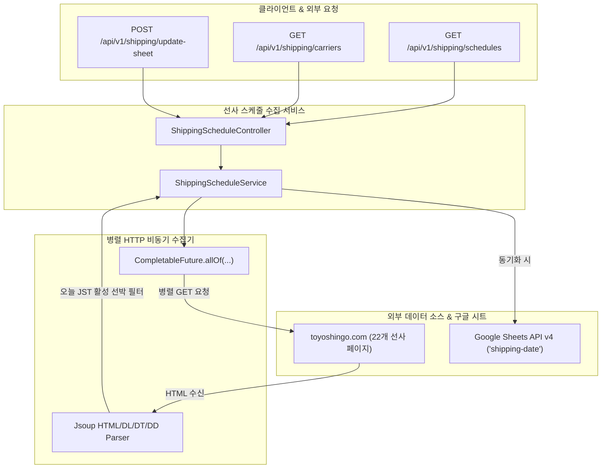

# FATES 일본→한국 선사 출항 스케줄 수집 및 구글 시트 동기화 시스템 상세 설계서
## (Shipping Schedule Aggregation Subsystem Specification)

**문서 버전**: v1.0.0  
**작성일**: 2026-09-04  
**시스템명**: FATES Shipping Schedule Aggregation Subsystem  
**개발 환경**: Java 17, Spring Boot 4.x / Gradle  
**대상 리포지토리**: `fates-system`

---

## 1. 개요 (System Overview)

### 1.1 배경 및 목적
독립 스크립트로 운영되던 **일본→한국 선박 스케줄 수집 및 구글 시트 동기화 파이프라인**을 `fates-system` 백엔드로 통합하여 관리합니다.
26개 선사(HMM, SINOKOR, HEUNG A, CK LINE, COSCO, HAPAG-LLOYD, YANG MING, STAROCEAN, HASCO, SMC, MAERSK, MSC, ONE, EVERGREEN, CMA CGM, TS LINES, PANCON, TCLC, SITC, WANHAI, NAMSUNG, DONGJIN, OOCL, INTERASIA, DONGYOUNG, KMTC)의 `vessel-schedule-service.com` API 및 `toyoshingo.com` 공개 페이지를 동시 수집하여, **오늘(당일)과 연관(입항/접안/출항)**되어 있으면서 **도착지가 한국(BUSAN, INCHEON, GWANGYANG, KOREA 등)**인 선박 스케줄을 추출하고 구글 시트에 자동으로 동기화합니다.

### 1.2 주요 기능
1. **26개 선사 병렬 비동기 수집**: Java `HttpClient` 및 `CompletableFuture` 기반 비동기 병렬 요청으로 수초 내 전체 선사 스케줄 수집 완료.
2. **신규 VSS REST API 및 레거시 HTML 크롤링 하이브리드 지원**: VSS API 우선 호출 후 미지원 선사는 HTML DOM 및 DL/DT/DD 파서로 추출.
3. **오늘 날짜 연관 선박 필터링**: 입항(Arrival), 접안(Berthing), 출항(Sailing) 중 오늘 날짜(JST/KST 기준)와 일치하거나 연관된 활성 선박만 정밀 필터링.
4. **한국 도착(POD) 전용 필터링**: 타국(중국, 동남아 등) 경유/도착 노선을 제외하고 **한국 도착(부산/인천/광양/평택/울산 등)** 대상 선박 스케줄만 추출.
5. **구글 시트(`shipping-date`) 자동 동기화**: `POST /api/v1/shipping/update-sheet` 호출 시 기존 시트 범위를 클리어하고 헤더(`선사`, `선박명`, `선박번호`, `출발항(POL)`, `도착항(POD)`, `Arrival`, `Berthing`, `Sailing`, `터미널`) 및 상세 데이터 일괄 업데이트.
6. **REST API 엔드포인트**: 전체 또는 지정 선사 필터링 스케줄 조회 REST API 제공.

---

## 2. 시스템 아키텍처 및 데이터 흐름 (Architecture & Workflow)



---

## 3. 핵심 컴포넌트 명세 (Component Specifications)

### 3.1 `VesselScheduleDto`
- **위치**: `com.example.fates_system.dto.VesselScheduleDto`
- **필드**: `carrier`, `vesselName`, `voyage`, `arrival`, `berthing`, `sailing`, `terminal`

### 3.2 `ShippingScheduleService`
- **위치**: `com.example.fates_system.service.ShippingScheduleService`
- **주요 메서드**:
  - `getCarriers()`: 지원 선사 22개 이름, 슬러그, URL 리스트 반환.
  - `fetchSchedules(requestedCarriers)`: 요청 선사 목록 비동기 병렬 Scraping 수행 및 DTO 요약 생성.
  - `parseCarrierHtml(html, carrierName, today)`: Jsoup 기반 HTML 파싱 및 당일(JST) 날짜 검증.
  - `updateShippingGoogleSheet(spreadsheetId)`: 구글 시트 기존 셀 클리어 후 헤더 및 최신 스케줄 데이터 쓰기.

### 3.3 `ShippingScheduleController`
- **위치**: `com.example.fates_system.controller.ShippingScheduleController`
- **엔드포인트**:
  - `GET /api/v1/shipping/schedules`: 당일 스케줄 조회 (파라미터 `carriers=HMM,CK LINE` 선택 가능)
  - `GET /api/v1/shipping/carriers`: 지원 선사 목록 조회
  - `POST /api/v1/shipping/update-sheet`: 구글 시트에 스케줄 동기화

---

## 4. REST API 명세서

### 4.1 당일 선박 스케줄 조회
- **Method**: `GET`
- **URL**: `/api/v1/shipping/schedules`
- **Query Parameter**: `carriers` (선택, 예: `HMM,CK LINE,SINOKOR`)
- **응답 (Response 200 OK)**:
```json
{
  "date": "2026-09-04",
  "fetchedAt": "2026-09-04T15:00:00+09:00",
  "totalCount": 12,
  "schedules": [
    {
      "carrier": "CK LINE",
      "vesselName": "SUNNY FREESIA",
      "voyage": "2619W",
      "arrival": "2026/09/04 16:00",
      "berthing": "2026/09/04 18:00",
      "sailing": "2026/09/05 05:00",
      "terminal": "品川埠頭C"
    }
  ]
}
```

### 4.2 구글 시트 스케줄 동기화
- **Method**: `POST`
- **URL**: `/api/v1/shipping/update-sheet`
- **Query Parameter**: `spreadsheetId` (선택)
- **응답 (Response 200 OK)**:
```json
{
  "status": "SUCCESS",
  "message": "Shipping schedules updated into Google Sheet successfully"
}
```
